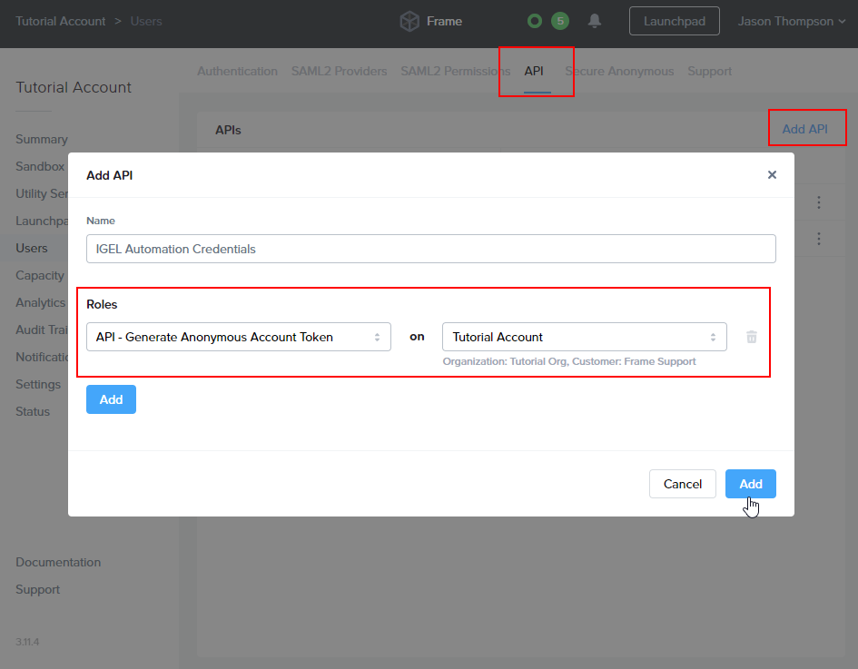
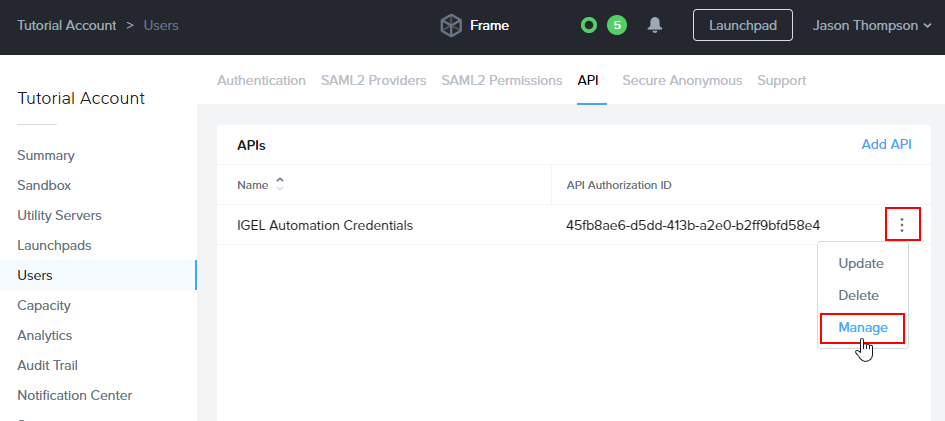
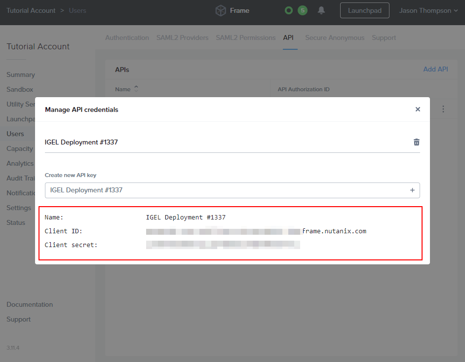

# Frame (22 Aug 2024)

-----

**📢 Announcement:**
> [Dizzion Acquires Frame from Nutanix to Accelerate Growth in DaaS Market](https://www.nutanix.com/products/frame/faq)

> [IGEL Community Docs - Frame](https://igel-community.github.io/IGEL-Docs-v02/Docs/HOWTO-Frame-Setup/)

-----

| CP Information        |                                                                                                               |
| --------------------- | ------------------------------------------------------------------------------------------------------------- |
| Package               | Frame - Current Version                                                                                       |
| Script Name           | [frame-cp-init-script.sh](build/frame-cp-init-script.sh)                                                      |
| CP Mount Path         | /custom/frame                                                                                                 |
| CP Size               | 500M                                                                                                          |
| IGEL OS Version (min) | 11.08.230                                                                                                     |
| Download package      | Download Latest Frame App for Linux (Debian) <br /> https://docs.fra.me/downloads                             |
| Packaging Notes       | See build script for details                                                                                  |
| Package automation    | [build-frame-cp.sh](build/build-frame-cp.sh)                                                                  |

-----

## Frame App 7.x support

**Frame App 7.x is now supported**. You can now build Custom Partition bundles with Frame App 7.x.x!

**Note:** the *Basic Frame App Profile* now defaults to Frame App 7.x installation paths. If you'd like to bundle/use Frame App 6, please import the [Frame App 6 Basic Profile](igel/frame-app-v6-basic-profile.xml).

-----

## Frame App IGEL Bundling instructions For Ubuntu 18.04
1. Download the latest [Frame App for Linux (Debian)](https://docs.fra.me/downloads) to your `~/Downloads` directory.
2. Download and unzip `Frame.zip` from [https://github.com/IGEL-Community/IGEL-Custom-Partitions/raw/master/CP_Packages/Apps/Frame.zip](https://github.com/IGEL-Community/IGEL-Custom-Partitions/raw/master/CP_Packages/Apps/Frame.zip).
3. Using a terminal, navigate to the unzipped directory to `/target/build/` and execute `build-frame-cp.sh`
   - **Note:** For Frame App **6.x** and below, use `build-frame-cp-legacy.sh`.
4. Copy `frame.ini` and `frame.tar.bz2` from `/target/` to the UMS RemoteManager server.
   1. Linux UMS host: `/opt/IGEL/RemoteManager/rmguiserver/webapps/ums_filetransfer/Frame/`
   2. Windows UMS host: `C:/Program Files/IGEL/RemoteManager/rmguiserver/webapps/ums_filetransfer/Frame/`
5. Import Frame's Custom Profile(s) from `/igel/*`
6. Edit the profile and
set up *Firmware Customization -> Custom Partition -> Download* with your UMS server info and credentials.
7. Setup env variables as instructed in the guides below.

## Frame IGEL Custom Profiles

- [Basic Frame App Profile](#basic-frame-app-profile)
- [Frame SAML2 Kiosk Mode Profile](#frame-saml2-kiosk-mode-profile)
- [Frame SAT Kiosk Mode Profile](#frame-sat-kiosk-mode-profile)

-----

## Frame App Releases

### Frame App 7.5.0 (GA)

Published on July 23, 2024

**Added:**

Command line arguments:

| Action    | Argument/Example |
| --------  | ------- |
| Show Help Menu  | Frame.exe -- --help |
| Show Version | Frame.exe -- --version |
| Hide Menu Bar  | Frame.exe --hide-menu-bar=ON  |
| Hide fullscreen toggle | Frame.exe -- --hide-toggle-fullscreen=ON |
| Enable Hardware Acceleration | Frame.exe -- --use-experimental-gpu-flags=ON |

(IGEL) Command line arguments are now configurable via settings in the IGEL UI.

**Fixed:**

- Issue where the generic USB driver may not uninstall properly from peripheral device when using Generic USB Redirection.
- (IGEL) Issue with kiosk mode script not working properly.

### Frame App 7.4.0 (GA)

Published on March 18, 2024

**Added:**

- Upgraded to Electron version 28.2.7.
- Integrated with Chromium version 120.
- Users may now navigate to View > Show GPU Internals to see an in-depth GPU hardware acceleration report.
- Frame App can now be configured to start both the application and sessions in full screen mode (a.k.a. "kiosk mode").
- Hardware acceleration can now be disabled via toggle in the Frame > Preferences menu.

**Fixed:**

- (Windows, Linux) Issue where keyboard input was not correctly refocusing on the Frame App window after switching between local desktops using CTRL + Windows Key + Arrow or Ctrl + Alt + Arrow (Linux).
- Additional reliability and optimization fixes.

**Known Limitations:**

- USB mass storage devices are not supported with Generic USB Redirection. Please use the Upload / Download feature.
- USB devices that require isochronous data transfers are not supported with Generic USB Redirection.
- (Linux) Auto-update feature is disabled by design for Linux endpoints.

### Frame App 7.3.0 (Early access)

Published on January 25, 2024

**Added:**

- (macOS) USB device redirection is now supported. Users wishing to take advantage of this feature must grant permissions to the Frame USB Helper upon the first launch of the application.
- The underlying Chromium engine has been upgraded to version 118, ensuring a more robust and secure experience.

**Fixed:**

(Windows) Resolved an issue where keyboard redirection for certain shortcuts using special keys would not work when microphone functionality was enabled.

### Frame App 7.2.0 (Tech preview)

Published on November 30, 2023

**Added:**

- USB device names are more descriptive, displaying the vendor name and USB device class/subclass.
- The Frame App menu bar is now hidden when entering full screen mode.
- Users can now exit full screen mode by long-pressing Esc key.
- Full-screen toggling is now synchronized across all displays in a multi-monitor setup.
- (Windows) New log for the Frame App Service (used for Generic USB Redirection support) can be found here: C:\Windows\_System32_\config\systemprofile\AppData\Roaming\Frame\Logs
- (macOS) Automatic updates for Frame App are now enabled.
-(Linux) Keyboard redirection in Frame App for Linux now interprets the following key combinations:
  - Alt + Tab
  - Shift + Alt + Tab
  - Meta + Tab
  - Shift + Meta + Tab
  - Meta

**Fixed:**

- Issue where device driver switching (as part of Generic USB Redirection feature) could not be canceled once initiated when exiting Frame App.
- (Windows) Issue when Frame App is forcefully stopped (e.g. terminating the Frame App Service through Task Manager) any USB devices that were switched by Frame App to leverage WinUSB instead of its native driver (due to compatibility issues) would not automatically rollback to using its native driver.
- (Windows) Issue where pressing the Windows key would, on occasion, open the local Windows Start Menu on the endpoint OS instead of passing it through to the Frame session.
- (Windows) Frame App installer now skips the Visual C++ (x64) Redistributable installation if it is already present.
- (macOS) Issue where gray bars would appear on the window edges when Frame App entered full-screen mode with the hideStatusBarOnFullscreen Advanced Terminal Argument set.
Additional reliability and optimization fixes.

**Known Limitations:**

- USB mass storage devices are not supported with Generic USB Redirection. Please use the Upload / Download feature.
- USB devices that require isochronous data transfers are not supported with Generic USB Redirection.
- Frame App’s kiosk mode feature is no longer available with Frame App 7.x. This was removed due to security concerns as kiosk-type experiences should be configured at the OS.
- (Windows) Keyboard redirection for certain shortcuts using special keys will not work when microphone functionality is enabled. Will be fixed in future release.
- (macOS) FIDO2/WebAuthn hardware authentication tokens are not supported with this release. Will be available in future release.
- (Linux) Auto-update feature is disabled by design for Linux endpoints.

### Frame App 7.1.0  (Early access)

Published on September 7, 2023

**Added:**
(Windows) Changed installation directory from C:\Program Files (x86)\Frame to C:\Program Files\Frame.
(Linux) Generic USB Redirection support (including support for FIDO2/WebAuthn hardware authentication tokens).

**Fixed:**
- Issue where USB device cannot be reconnected after it is detached from the session.
- Issue where users can launch second instance of Frame App. Attempts to start a second instance simply brings existing Frame App instance window to the front.
- (Windows) Issue where the FrameAppService may fail to start on when installing Frame App on Windows 10 or 11.
- (Windows) Issue where resizing Frame App window using mouse cursor was not possible.
- (Windows) Issue where pressing the Windows key on endpoint device results in the Windows Start Menu opening on both the local device and within the Frame session. Now Windows Start Menu only opens within the Frame session when Frame App window is in focus.
- (macOS) Issue where Frame App may crash on first launch.
- (macOS, Linux) Issue where modifier keys (e.g. Alt + Tab) are not properly passed into session when accessing a Windows workload VM.

**Known Limitations:**

- USB mass storage devices are not supported with Generic USB Redirection. Please use the Upload / Download feature.
- USB devices that require isochronous data transfers are not supported with Generic USB Redirection.
- (macOS) Auto-update from Frame App 7.0.x to 7.1.0 will not work. Customers should uninstall the previous version and then install the new version. Auto-update from Frame App 7.1.0 to future versions will work as expected.
- (macOS) Kiosk mode is not supported with this release. Will be available in future release.
- (macOS) FIDO2/WebAuthn hardware authentication tokens are not supported with this release. Will be available in future release.
- (Linux) Auto-update feature is disabled by design for Linux endpoints.

### Frame App 7.0.21 (Tech Preview)

Published on June 2, 2023

**Added:**

- New architecture based on Electron (version 24.3.1) framework.
- Revamped and unified UX/GUI.
- New generic USB redirection architecture based on WebUSB (device driver must be compatible wth WebUSB) and includes support for multi-interface devices.
- Support for Google Sign-in (OAuth 2.0).
- Diagnostics tools (WebRTC Internals, GPU Internals, Developer Tools)
- Support for metadata logging locally and to Frame Platform.

**Known Limitations:**

- No support for installation via CLI.
- No support for centralized configuration (GPO, .plist, preferences.conf, etc.).
- No ability to enable/disable auto-update feature.
  - Enabled for Windows and macOS
  - Disabled for Linux
- No clear local cache feature.
- No support for FIDO2/WebAuthn hardware authentication tokens.
- **\[macOS\]** No kiosk mode support.

-----

### Frame App 6.16

Published on 2022-12-08

Added:

General

- Ability for users to automatically enable sound, microphone, and webcam via Preferences.

- Ability to hide the [Frame Status Bar](https://docs.fra.me/enduser/enduser-navaccount.html#status-bar) when in full-screen mode with Frame App. This feature can be enabled by setting the following Advanced Terminal Argument (either within Dashboard > Settings > Session > Advanced Options or Dashboard > Launchpads > Session Settings > Advanced Options).

- Advanced Terminal Argument: `hideStatusBarOnFullscreen`

Fixed:

General

- Issue where Frame App would automatically exit full-screen mode when session closed while in [kiosk mode](https://docs.fra.me/platform/session/frame-app/config/#frapp-args).

- Issue where users were able to exit full-screen mode while in [kiosk mode](https://docs.fra.me/platform/session/frame-app/config/#frapp-args).

- Additional reliability fixes.

-----

## Frame IGEL Custom Profiles

To get started, read each of the following profiles to see which sounds like the right fit for you and then import it into the IGEL UMS following the instructions below.

### Important notice

IGEL UMS-11 profiles has ***-ums11.xml** in their name.  
IGEL UMS-12 profiles has ***-ums12.ipm** in their name

IGEL UMS-11 profiles by default will provide support for Frame App v7 only! If support for frame app v6 is required, before importing profiles user will need to modify following line in XML file:

```
<ivalue classname="sessions.custom_application%.cmdline" variableExpression="" variableSubstitutionActive="false">/custom/frame/frame-saml2-kiosk-launcher.sh v7</ivalue>
```
by replacing "v7" with "v6", so that script will know which version of app to start and other configurations.


### Basic Frame App Profile
**IGEL UMS-11 command:**
```js
import 'igel/frame-app-basic-profile-ums11.xml'
```

This Custom Profiles simply enables a Frame App icon on the IGEL Desktop. To launch Frame App with certain command line arguments, edit IGEL profile and append your command line argument(s) to the end of the command line.

Command line arguments for Frame app are defined here: [Linux command-line arguments](https://docs.fra.me/platform/session/frame-app/config/?operating-systems=linux#frapp-args).

### Frame SAML2 Kiosk Mode Profile

**IGEL UMS-11 command:**
```js
import 'igel/frame-saml2-kiosk-profile-ums11.xml'
```

This profile is designed to support a specific end user workflow and assumes a particular Frame configuration.

#### SAML2 Kiosk Mode User Experience

1. Frame App's cache is wiped to ensure a fresh session and authentication.
2. Frame App is launched in Kiosk Mode with multiple monitor support, presenting a third-party identity provider's login screen.
3. After logging in, end users will be taken by Frame App directly to the desktop or application (depends on the Launch Link configuration).
4. When a Frame session starts, the remote desktop will be in full-screen mode.
5. When end users disconnects by action or inactivity timeout, they'll see an option to resume their session for the duration of the account/Launchpad's configured idle timeout.
6. When a user quits the session or shuts down windows, they'll be logged out and redirected to the identity provider's initial login page.
7. If Frame App is closed, user can start a new session by launching Frame App with the Frame icon on the IGEL Desktop.

#### SAML2 + Kiosk mode requirements:

1. A *Published* Launchpad.
2. Configured identity provider with associated roles/permissions allowing access to the desired Frame Account.
3. Frame Launch Link with additional ["Quit and log out"](https://docs.fra.me/platform/session/advanced-integrations/#supported-query-params) url parameter: `&qlo=1`.
4. *Optional:* The Frame account production workload VMs can be joined to a Windows domain, if desired.

5. **Edit your IGEL UMS Custom Profile and go to**:
   > System > Firmware Customization > Environment Variables > Predefined

6. Paste your Launch Link:

     - `FRAME_LAUNCH_URL` - obtained from an Account's *Dashboard > Launchpad > Advanced Integrations* to get a configurable dialog with Launch Links. While we recommend Launch Links for Kiosk scenarios, the value of FRAME_LAUNCH_URL could instead be a standard Launchpad URL.

---

### Frame SAT Kiosk Mode Profile
**IGEL UMS-11 command:**
```js
import 'igel/frame-sat-kiosk-profile-ums11.xml'
```

The Frame SAT Kiosk Custom Profile is designed to support a specific end user workflow relying on Frame's SATs or [Secure Anonymous Tokens](https://docs.fra.me/platform/identity-and-access/secure-anonymous-tokens/) for identity; this flow also assumes a particular Frame configuration to support the kiosk experience as defined below.

#### SAT Kiosk Mode User Experience:

1. End users will not authenticate to a SAML2-based identity provider (this script uses the Frame Secure Anonymous Token (SAT) functionality for session authentication).
2. User cache is removed prior to start of Frame App to ensure no user preference settings have persisted since the prior use of Frame App.
3. Frame App will launch in "kiosk mode" (full screen).
4. End users will be taken by Frame App directly to the desktop or application (depends on the [Launch Link](https://docs.fra.me/platform/session/advanced-integrations/#launch-links) configuration).
5. When a Frame session starts, the remote desktop will be in full-screen mode.
6. When end users disconnect or close their session, Frame App will be restarted with a new SAT token. Disconnect behavior configurable with Frame Session Settings.

#### SAT + Kiosk configuration requirements:

1. A *Published* Launchpad.
2. API Provider configured at the Organization entity.
3. Secure Anonymous Token Provider at the Account entity granting a role of Launchpad User for a specific Launchpad in a Frame account (under the Organization entity).
4. Frame [Launch Link](https://docs.fra.me/platform/session/advanced-integrations/#launch-links) is used, rather than a Launchpad URL to support automatic start of the user's session and to simplify the UX.
5. *Optional:* The Frame account production workload VMs can be joined to a Windows domain, if desired.


#### Environment Variables

The following environment variables must be configured in the IGEL Custom Profile for this profile to work.

1. **Edit your IGEL UMS Custom Profile and go to**:
   > System > Firmware Customization > Environment Variables > Predefined

2. **Set the following environment variables:**
   - `FRAME_CLIENT_ID` - obtained from the API provider when a set of API credentials are created.
   - `FRAME_CLIENT_SECRET` - obtained from the API provider when a set of API credentials are created.
   -
      `FRAME_SAT_URL` - URL obtainable from the Playground.

      For example: `https://api.console.nutanix.com/v1/accounts/XXXXXXXX-XXXX-XXXX-XXXX-31d09e2881cd/secure-anonymous/secure-anon-XXXXXXXX-XXXX-XXXX-XXXX-c5e2dc93df1e/tokens`.
   - `FRAME_ACCOUNT_ID` - Sign in to [Frame Console](https://console.nutanix.com) as an Admin. Locate your account, click the three-dot menu, and select "update" to view the Account's entity settings. Next, copy the Account UUID from the browser's URL bar. For example: `https://console.nutanix.com/frame/account/YOUR-FRAME-ACCOUNT-UUID-HERE/basic-info`
   - `FRAME_EMAIL_DOMAIN` - email domain name used to create the anonymous user email addresses that will be visible in the Session Trail.
   - `FRAME_LAUNCH_URL` - obtained from an Account's *Dashboard > Launchpad > Advanced Integrations* to get a configurable dialog with Launch Links. While we recommend Launch Links for Kiosk scenarios, the value of FRAME_LAUNCH_URL could instead be a standard Launchpad URL.
   - `FRAME_TERMINAL_CONFIG_ID` - obtainable from the Launch Link URL or from your [Launchpad Settings -> Session API Integration](https://docs.fra.me/dev-hub/session-api/#required-session-api-components) dialog.
   - `FRAME_LOGOUT_URL` - Optional. Allows configuration of the "logout" behavior by specifying a URL. Useful when using a Frame Launch Link with additional ["Quit and log out"](https://docs.fra.me/platform/session/advanced-integrations/#supported-query-params) url parameter: `&qlo=1`.
   - `SESSION_RETRY_DURATION_MINUTES` - Optional. Default value of 10 (minutes). Specifies the duration this script will wait for a Session to connect to the workload VM. After this threshold is reached, the script will quit start over and try again.
   
---

### Frame Admin API and SAT quick setup guide

1. Enable API access

   > Account > Users > Authentication

   

2. Add an API

   > Account > Users > API

   Create an API with with the ability to generate anonymous tokens an account or organization.

   

3. Create a set of credentials for use with the Custom Profile.
   <figure>

   
   <figcaption>Manage Credentials</figcaption>
   </figure>

   <figure>

   
   <figcaption>Create new API key</figcaption>
   </figure>

   <figure>

   
   <figcaption>Copy the credentials for use in the IGEL Environment Variables. Keep it secret; keep it safe.</figcaption>
   </figure>

### Secure Anonymous Access Setup

#### 1. Enable "Secure Anonymous" access

  > Account > Users > Authentication

  

#### 2. Create Anonymous Access Provider

  > Account > Users > Secure Anonymous

  

#### 3. Add the Launchpad User role to the Provider


**Note:** If Launchpad User Role is not visible on the list, be sure you've created a launchpad first. If you have, refresh the page and try again.

#### 4. Copy Provide URL from Playground Examples


-----

## Additional Frame Profile Customizations

In order to hide taskbar and disable any user interaction with IGEL OS, following options must be enabled inside profile:

- User Interface - Desktop - Taskbar - Uncheck ‘Use Taskbar’
- User Interface - Desktop - Start Menu - Uncheck all options
