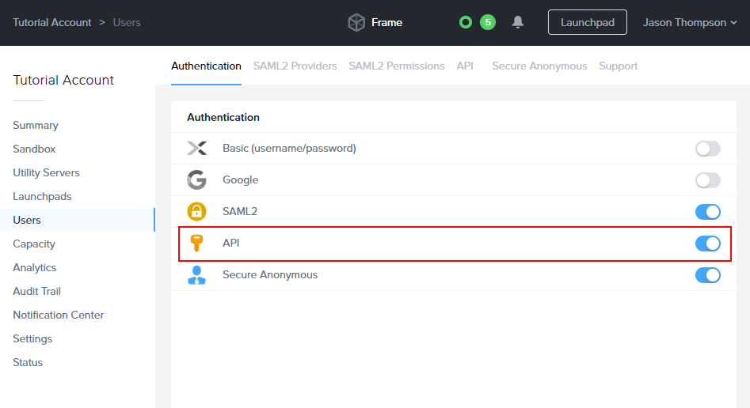

# Nutanix Frame

|  CP Information |            |
|--------------------|------------|
| Package | Nutanix Frame - Current Version |
| Script Name | [frame-cp-init-script.sh](frame-cp-init-script.sh) |
| CP Mount Path | /custom/frame |
| CP Size | 250M |
| IGEL OS Version (min) | 11.4.200 |
| Metadata File   frame.inf | [INFO]   [PART]   file="frame.tar.bz2"   version="5.3.0"   size="250M"   name="frame"   minfw="11.04.200" |
| Path to Executable | /custom/frame/usr/bin/frame |
| Path to Icon | /custom/frame/usr/share/pixmaps/frame.png |
| Missing Libraries | None |
| Download package | Obtain from client |
| Packaging Notes | Create folder: **frame**    dpkg -x <package/lib> custom/frame    Need to move the mime folder:   mv /custom/frame/usr/share/applications /custom/frame/usr/share/applications.mime |
| Package automation | [build-frame-cp.sh](build-frame-cp.sh) |

-----
# Configure Frame Account for IGEL

## Enable "Secure Anonymous" sessions

## Create Desktop/Application launchpad

[Add a launchpad](https://docs.frame.nutanix.com/launchpad-management/add-launchpad.html)

## Create Anonymous access provider
### (Account > Users > Secure Anonymous)

## Add Launchpad User Role on desktop

**Note:** If Launchpad User Role is not visible on the list, refresh the page and try again (NC-1055)

Copy Anonymous access provider name for later reference
(secure-anon-1c93a…)

## Enable API access
### (Account > Users > Authentication)

## Add API
### (Account > Users > API)

## Create API Key)
### (Account > Users > API)

**Copy Client ID** and **Clinet secret** for later reference

-----

## Add Frame Varibles to IGEL Profile
### (System > Firmware Customization > Environment Variables > Predefined)

#### FRAME_CLIENT_ID
#### FRAME_CLIENT_SECRET
#### FRAME_ORGANIZATION_ID
#### FRAME_ANONYMOUS_PROVIDER_NAME
#### FRAME_ACCOUNT_ID

-----

## Additional Profile Customization

In order to hide taskbar and disable any user interaction with IGEL OS, following options must be enabled inside profile:

- User Interface - Desktop - Taskbar - Uncheck ‘Use Taskbar’
- User Interface - Desktop - Start Menu - Uncheck all options
