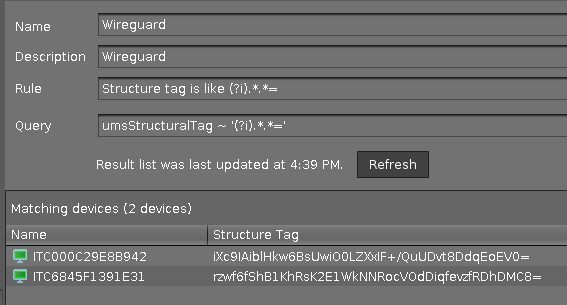

# WireGuard (5 October)

|  CP Information | **NOTE:** This is not a CP. It is a profile with an embedded script.            |
|--------------------|------------|
| Package | [WireGuard VPN](https://www.wireguard.com/) <br /><br /> WireGuard VPN requires the exchange of public keys. This profile will copy the public key from the endpoint to UMS and store it in the **ums_structure_tag**. |

This profile creates the following files in the **/wfs/wireguard** folder:

- igel_wg_setup.sh (Main script)
- wg_clients.csv (Mapping for IGEL clients IPv4 or IPv6 to WireGuard defined addresses)
- wg0.conf (Template file)

and the following file:

- /bin/igel_wg_control.sh (Displays current state of WireGuard and allows user to change state on / off)

The **igel_wg_setup.sh** script will create the client's public / private keys, send the client's public key to the UMS (ums_structure_tag), update wg0.conf template file, copy these files to **/etc/wireguard**, and start WireGuard.

**NOTE:** Two reboots are needed after this profile is assigned.

-----

## Profile Environment Variables > Predefined

This profile has the following environment variables and is based on the following document: [Automate WireGuard installation on Linux with Bash Script](https://techviewleo.com/automate-wireguard-installation-on-linux/)

- WG_PUBLIC_ADDRESS <- WG server IP or DNS
- WG_PORT <- WG server port
- WG_PUBLIC_KEY <- WG server public key
- WG_PRESHARE_KEY <- Client preshared key configured in WG server
- WG_ALLOWED_IPS <- Allowed IPv4+IPv6 range for client access (predefined to allow all IPv4+IPv6)

Update the values for these environment variables based on the settings in your WireGuard server.

-----

## UMS Structure Tag holds WireGuard client public key

```bash
setparam system.remotemanager.ums_structure_tag CLIENT_PUBLIC_KEY
write_rmsettings
get system.remotemanager.ums_structure_tag
```

In the UMS, a view can be created to show the mapping of client machines to their WireGuard public key. This view can be exported to a file and added to the WireGuard server.

UMS View


```bash
Name: WireGuard
Description: Wireguard
Rule: Structure tag is like (?i).*.*=
Query: umsStructuralTag ~ '(?i).*.*='
```

-----

## Mapping of IGEL clients to WireGuard defined addresses

**NOTE:** This is mandatory! IPv4 or IPv6 has to be the one configured o your WireGuard server.

Edit the profile (**System > Firmware Customization > Custom Commands > Network > Final Network Command**) to contain the mapping of clients (name of client) to WireGuard IPs. IPv4 or IPv6 can be used, insert IPv6 instead of predefined IPv4.

```bash
cat << 'EOF' > /wfs/wireguard/wg_clients.csv
ITC6845F1391E31,10.66.66.4/32
ITC0800270F8F75,10.66.66.5/32
ITC000C29A1EAF6,10.66.66.6/32
ITC000C29E8B942,10.66.66.7/32
EOF
```

-----

## WireGuard vs. Tailscale

[Tailscale](https://github.com/IGEL-Community/IGEL-Custom-Partitions/tree/master/CP_Source/Network/Tailscale_VPN) is built on top of WireGuard and acts as a holder of public keys, network ports, and private IP addresses.

[Tailscale post on WireGuard](https://tailscale.com/compare/wireguard/)
