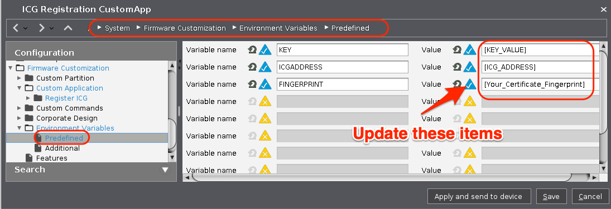

# ICG (IGEL Cloud Gateway) Register (11 February Update)

|  CP Information | **NOTE:** This is not a CP. It is a profile with an embedded command.            |
|--------------------|------------|
| Package | ICG-Register 1.01 |
| IGEL OS Version (min) | 11.04.240 |
| Notes | Profile with custom application with predined variables that allow a user, with one click on icon on desktop, to register with IGEL ICG.  <br /><br /> Update variables in profile (System > Firmware Customization > Environment Variables > Predefined):  KEY, ICGADDRESS, FINGERPRINT <br /><br /> Assign profile to devices |

## ICG Command (Version 01):
```{icg command}
/sbin/icg-config -s $ICGADDRESS -o $KEY -f $FINGERPRINT;\
zenity --warning --text="The Device was registered to the IGEL Cloud Gateway (ICG) and will be restarted now." --ellipsize;\
reboot
  ```

## ICG Command (Version 02):
```{icg command}
pkexec --user root /sbin/icg-config -s $ICGADDRESS -o $KEY -f $FINGERPRINT;\
zenity --warning --text="The Device was registered to the IGEL Cloud Gateway and will be restarted now." --ellipsize;\
reboot
  ```




------

## Steps to add ICG connection to OSC installer:

**NOTE** Do this on a VM (virtual machine) to allow cut and paste of script

- Boot up OSC on a VM
- Press the "edit settings" button
- add your custom command script

**This saves the settings for subsequent installs**

```
cat << 'EOF' >> /bin/igel_icg_setup.sh
#!/bin/bash
#set -x
#trap read debug

ACTION="connect_to_icg_${1}"

# output to systemlog with ID amd tag
LOGGER="logger -it ${ACTION}"

echo "Starting" | $LOGGER

/sbin/icg-config -s SERVER_NAME -p PORT -o ONE_TIME_PASSWORD -t UMS_STRUCTURE_TAG &
EOF

chmod a+x /bin/igel_icg_setup.sh
/bin/igel_icg_setup.sh &
  ```
