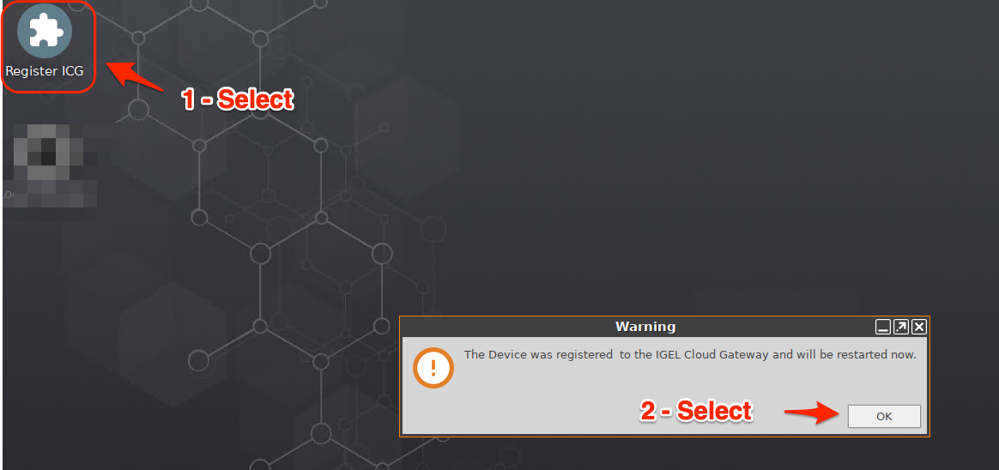

# ICG (IGEL Cloud Gateway) Register (9 December)

|  CP Information | **NOTE:** This is not a CP. It is a profile with an embedded command.            |
|--------------------|------------|
| Package | ICG-Register 1.01 |
| IGEL OS Version (min) | 11.06.100 |
| Notes | Profile with custom application with predined variables that allow a user, with one click on icon on desktop, to register with IGEL ICG.  <br /><br /> Update variables in profile (System > Firmware Customization > Environment Variables > Predefined):  KEY, ICGADDRESS, FINGERPRINT <br /><br /> Assign profile to devices |

-----

# NOTE: IGEL UMS Method for ICG setup (Add / Remove)

If you have the devices connected to UMS already, the KB below describes the IGEL supported method. The method mentioned here may cause problems in a production environment.

[Moving an Endpoint Device to an ICG](https://kb.igel.com/igelicg-2.05/en/moving-an-endpoint-device-to-an-icg-57324473.html)

-----

## ICG Command (Version 01):
```{icg command}
/sbin/icg-config -s $ICGADDRESS -o $KEY -f $FINGERPRINT;\
zenity --warning --text="The Device was registered to the IGEL Cloud Gateway (ICG) and will be restarted now." --ellipsize;\
reboot
  ```

## ICG Command (Version 02):
```{icg command}
pkexec --user root /sbin/icg-config -s $ICGADDRESS -o $KEY -f $FINGERPRINT;\
zenity --warning --text="The Device was registered to the IGEL Cloud Gateway and will be restarted now." --ellipsize;\
reboot
  ```




## ICG Command (Version 02) Modify to remove fingerprint:

The new Auto register Custom App accept user name and password and do not need a fingerprint (wildcard option). You can change "root" with another user, also if that user have a password. An login window appears to type in the password.

```{icg command}
pkexec --user root /sbin/icg-config -s $ICGADDRESS -o $KEY -f '*';\
zenity --warning --text="The Device was registered to the IGEL Cloud Gateway and will be restarted now." --ellipsize;\
reboot
  ```

------

## ICG Command (Version 03):

ICG Auto Registration Script which was worked out together with IGEL development.

**NOTE:** If you see that the script doesn't seem to be running, then this is because from 11.05.100 the parameter system.icg.server0.host is not emptied during a reset. This can be checked with this command:

 ```
get system.icg.server0.host
  ```

If you delete the content or enter a value that differs from the script, the registration works reliably again.

------

## Steps to add ICG connection to OSC installer:

**NOTE** Do this on a VM (virtual machine) to allow cut and paste of script

- Boot up OSC on a VM
- Press the "edit settings" button
- add your custom command script

**This saves the settings for subsequent installs**

```
cat << 'EOF' >> /bin/igel_icg_setup.sh
#!/bin/bash
#set -x
#trap read debug

ACTION="connect_to_icg_${1}"

# output to systemlog with ID amd tag
LOGGER="logger -it ${ACTION}"

echo "Starting" | $LOGGER

/sbin/icg-config -s SERVER_NAME -p PORT -o ONE_TIME_PASSWORD -t UMS_STRUCTURE_TAG &
EOF

chmod a+x /bin/igel_icg_setup.sh
/bin/igel_icg_setup.sh &
  ```
